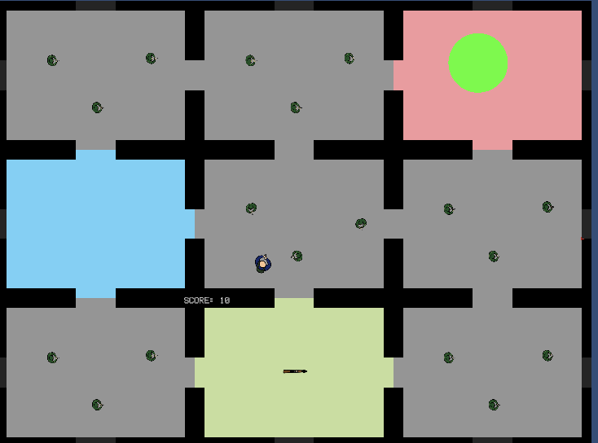

# CSSAJam2019
 
The theme for this project was _1 HP_.

Top-down dungeon crawler shooter.

Developed in Unity in a group of 4.
Arvind Maan, Caden Chabot, Andy Tan, Aaron Salo.

The game is in developement, so the below images are temporary and are likely to be redrawn or changed.

Below is the hero of our game,

 

The below grid is a picture of an example arrangement of how the rooms could be generated,

 

The hero exists in a grid of randomly generated rooms (as seen above), these rooms will randomly generate 6 regular rooms, a shop room, the boss room, and the starting room. 

The idea behind this project is to have a hero that climbs a 'tower' by clearing every room and defeating the floor boss. 

## Contributers

<table>
<tr>
    <td style="text-align: center;">
        <a href="https://github.com/aaronsalo">
            
             
            
                <b>Aaron Salo</b>
            
        </a>
    </td>
    <td style="text-align: center;">
        <a href="https://github.com/andy-tan7">
            
             
            
                <b>Andy Tan</b>
            
        </a>
    </td>
        <td style="text-align: center;">
        <a href="https://github.com/arvind-maan">
            
             
            
                <b>Arvind Maan</b>
            
        </a>
    </td>
        <td style="text-align: center;">
        <a href="https://github.com/cadenchabot">
            
             
            
                <b>Caden Chabot</b>
            
        </a>
    </td>
</tr>
</table>
